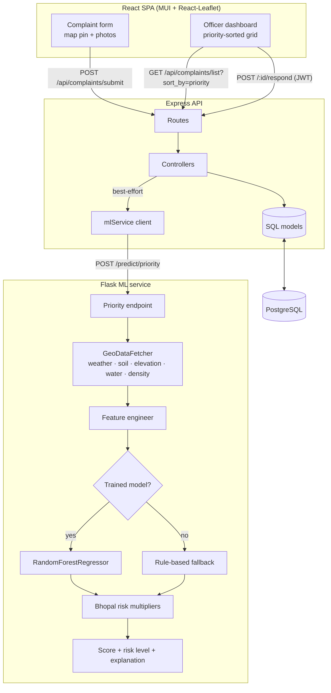

# AquaConnect

**A civic-tech platform that turns citizen water-issue reports into a priority-ranked work queue for city officials — using a geospatial ML microservice that scores each complaint's real-world hazard.**

AquaConnect (built for Bhopal) closes the loop between residents and the water utility: a citizen drops a pin and reports a leak, burst pipe, or water-logging; a machine-learning service enriches the report with weather, soil, elevation, and proximity-to-water data and assigns a 1–100 priority score; officers work a dashboard sorted by that score and post back the action taken. This README focuses on how it's built.


## Engineering highlights

- **ML-scored triage, not FIFO** — every complaint is scored 1–100 by a scikit-learn `RandomForestRegressor` over ten environmental features (issue type, soil, rainfall, wind, temperature, humidity, elevation, water proximity, population density, dry-spell length). The officer dashboard is sorted by score so the most hazardous issues surface first.
- **Graceful degradation everywhere** — the ML service ships with a transparent **rule-based fallback**, so it produces sensible scores *before any model is trained* and whenever the RandomForest file is absent. Every external data fetch (weather, elevation, soil) falls back to Bhopal-typical defaults, so the whole system runs offline with **zero API keys**.
- **Domain-tuned scoring** — a generic score is adjusted with Bhopal-specific risk multipliers: **black-cotton soil** (expands when wet → water-logging), high population density, and proximity to the Upper/Lower Lakes. Each score ships with a human-readable `explanation` of *why* it's high.
- **Best-effort service boundary** — the API treats the ML service as non-critical: if it's slow or down, complaint submission still succeeds with a neutral fallback score rather than failing the citizen's request.
- **Three-service architecture** — React SPA, Express/PostgreSQL API, and a Flask/scikit-learn model server, each independently Dockerised and wired together with one `docker-compose up`.
- **Clean separation** — SQL-parameterised data models, JWT-guarded officer endpoints with role checks, multer image uploads with type/size limits, and a geospatial layer split into a `data_fetcher` (I/O) and a `feature_engineer` (encoding) so the model code stays pure.

## System architecture



## The ML pipeline in detail

### 1. Feature assembly

For each complaint the service resolves the location into an environmental feature vector ([ml-service/utils/data_fetcher.py](ml-service/utils/data_fetcher.py)):

| Signal | Source | Offline fallback |
|---|---|---|
| Temperature, humidity, wind, rainfall | OpenWeatherMap | Bhopal seasonal defaults |
| Elevation | OpenTopoData | 500 m (plateau) |
| Soil type | Local Bhopal soil-zone map (nearest zone) | `alluvial` |
| Water proximity | Local lakes GeoJSON (haversine to nearest) | 5 km |
| Population density | Distance-to-centre proxy | 1 500/km² floor |

Missing keys never crash a request — each fetch is wrapped and defaulted.

### 2. Scoring

`PriorityScorer.calculate_hazard_score` ([ml-service/priority_model.py](ml-service/priority_model.py)) loads the trained `RandomForestRegressor` if `models/priority_model.pkl` exists; otherwise it uses a rule-based scorer weighted by issue severity and rainfall. Either base score is then multiplied by Bhopal risk factors and clipped to 1–100. A five-band risk level (`MINOR → CRITICAL`) and an `explanation` list are returned alongside the number.

### 3. Training

`models/train_model.py` fits the forest from a labelled CSV ([ml-service/data/training_data.csv](ml-service/data/training_data.csv)), persisting `priority_model.pkl` + `encoders.pkl`. Model artifacts are gitignored — the service runs rule-based until you train.

```bash
cd ml-service && python models/train_model.py    # writes models/*.pkl
```

## Data model

PostgreSQL schema ([database/init.sql](database/init.sql)), loaded automatically on first container start:

- **users** — citizens and officers (`role`: citizen / officer / admin), bcrypt password hashes.
- **complaints** — geotagged report with `issue_type`, `image_urls[]`, `status`, and the ML `priority_score` (indexed for the sorted dashboard).
- **responses** — officer action taken per complaint (resolves it).
- **environmental_data** — per-complaint environmental snapshot, for growing the training set over time.

## Repository layout

```
backend/src/
  app.js                 # Express app, routes, static uploads, error handler
  config/                # env config + pg connection pool
  controllers/           # complaint + user (auth) request handlers
  models/                # parameterised SQL for complaints, responses, users
  middleware/            # JWT auth + role guard, multer image upload
  services/mlService.js  # best-effort client for the ML microservice
  routes/                # /api/complaints, /api/users
ml-service/
  api/                   # Flask app factory + priority blueprint
  priority_model.py      # scorer: RandomForest + rule-based fallback + explanations
  utils/                 # data_fetcher (geospatial I/O) + feature_engineer (encoding)
  models/train_model.py  # training entrypoint
  data/                  # soil map, water bodies, training CSV
frontend/
  src/components/         # ComplaintForm (map + photos), ComplaintDashboard (grid)
  src/App.jsx, index.js   # tabbed shell
  nginx.conf              # serves the build, proxies /api → backend
database/init.sql         # schema + seed data
docker-compose.yml        # postgres · redis · backend · ml-service · frontend
```

## Local development

The whole stack comes up with one command:

```bash
cp .env.example .env        # optional: add OPENWEATHER_API_KEY, set JWT_SECRET
docker compose up --build
# frontend  → http://localhost:3000
# API       → http://localhost:3001/health
# ML        → http://localhost:5000/health
```

Run services individually while developing:

```bash
# API
cd backend/src && cp .env.example .env && npm install && npm run dev

# ML service
cd ml-service && pip install -r requirements.txt && python api/app.py

# Frontend
cd frontend && npm install && npm start
```

The frontend dev server proxies `/api` to `localhost:3001`; in Docker, nginx proxies it to the backend container. The ML service needs no keys to run — it scores with rule-based + offline defaults out of the box.

## Status

AquaConnect is a portfolio / hackathon project. The three services are wired end-to-end and verified: the API and ML service pass their checks, the ML pipeline is exercised end-to-end (rule-based scoring, model training, and the `/predict/priority` endpoint), and the React client builds cleanly. Auth, uploads, and the officer workflow are implemented; production hardening (rate limiting, richer training data, real geospatial API keys) is left as clearly marked extension points.
